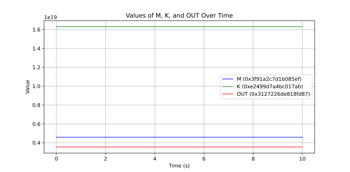

---
title: "DES ENCRYPTION IN FPGA USING VERILOG"
author:
  - Lakshit Verma
  - Priyansh Sarkar
  - Ayush Gupta
date: "February 5, 2025"
geometry: margin=3cm
...

## 1. INTRODUCTION

### a. Background Information

The Data Encryption Standard (DES) is a symmetric-key algorithm for the encryption of digital data, originally developed in the early 1970s by IBM and later adopted as a federal standard by the U.S. National Institute of Standards and Technology (NIST) under **FIPS PUB 46-3**. DES operates on 64-bit blocks of plaintext using a 64-bit key and involves 16 rounds of permutation and substitution operations. For brevity's sake, our implementation works on a single 64-bit block of data.

### b. Objectives and Scope
This project aims to implement the DES encryption and decryption process on an FPGA using Verilog. The main objectives are:

- To develop an efficient hardware implementation of DES using FPGA.

- To optimize the Verilog design for minimal resource utilization and high-speed performance.

- To verify the correctness of the implementation through simulation.

### c. Overview of the Verilog Design

The design consists of multiple modules, including:

- **Key Scheduling (`KS`):** Generates 16 round keys from the input key.

- **Feistel Function (f-function):** Performs expansion, substitution, and permutation.

- **Initial and Final Permutations (`IP` and `IP_inv`):** Reorder bits before and after encryption.

- **DES Core:** Implements the complete encryption algorithm.

### d. Problem Definition and Motivation
With increasing threats to data security, implementing encryption algorithms in hardware provides enhanced performance and resistance to software-based attacks. An FPGA-based DES implementation ensures low-latency encryption, making it ideal for high-speed secure communication applications.

## 2. SYSTEM DESIGN AND ARCHITECTURE

### a. High-Level Design Overview
The DES encryption system follows a **Feistel network** structure with 16 rounds of operations. The block diagram of the system is as follows:

```
      +------------------+          +--------------+        +--------------+
      |    Input Data    |  ----->  | Initial Perm | ---->  | 16 Round Ops |
      +------------------+          +--------------+        +--------------+
                                                                    |
                                                                    v
      +-------------------+         +--------------+        +--------------+
      |   Key Expansion   | ----->  |  Round Keys  | ---->  | Feistel Func |
      +-------------------+         +--------------+        +--------------+
                                                                    |
                                                                    v
                                     +------------+          +------------+
                                     | Final Perm |  <-----  |   Output   |
                                     +------------+          +------------+
```


### b. System Architecture
The system consists of the following major components:

1. **Initial Permutation (`IP`):** Rearranges the input data bits.

2. **16 Rounds of Feistel Network:** Each round involves:
   - Expansion (`E`)
   - XOR with round key
   - Substitution using 8 S-boxes
   - Permutation (`P`)
   - Swap between left and right halves

3. **Key Scheduler (`KS`):** Generates 16 keys for the rounds using permutations (`PC1`, `PC2`) and left shifts.

4. **Final Permutation (`IP_inv`):** Restores the bit order after processing.

### c. Key Modules and Interconnections
- `f`: Implements the Feistel function using expansion, S-box substitution, and permutation.
- `KS`: Implements the key scheduling algorithm to generate round keys.
- `IP` and `IP_inv`: Initial and final permutations.
- `DES`: The main module integrating all components.
- `testbench`: Used for verifying the correctness of the design.

### d. Design Choices

- **Use of Bitwise XOR for Key Mixing:** Enhances security while keeping logic simple.
- **Modular Approach:** Enhances readability, reusability, and debugging.

\pagebreak

## 3. RESULTS AND WAVEFORMS

The testbench verifies the DES encryption module using a testbench:

```
module testbench;
  reg [64:1] M;
  reg [64:1] K;
  wire [64:1] OUT;

  DES des_inst(M, K, OUT); // Our DES module

  initial begin
    M = 64'h3f91a2c7d1b085ef; // Plaintext
    K = 64'he2499d7a4bc017ab; // Key
    #1
    $finish;
  end
  initial $monitor($time, " M=0x%x, K=0x%x, OUT=0x%x", M, K, OUT); // OUT = Ciphertext
endmodule
```

{ width=78% }

## 4. CONCLUSION
This project successfully implements the DES encryption algorithm using Verilog, verifying its correctness through testbenches and simulations. The modular design ensures flexibility for future improvements, such as optimizing for speed or power efficiency. The FPGA-based approach provides a high-performance alternative to software implementations, making it suitable for security-critical applications.

### References

_FIPS PUB 46-3, **"Data Encryption Standard (DES)"** U.S. Department of Commerce, National Institute of Standards and Technology, Reaffirmed October 25, 1999._

### Keywords
DES, Verilog, FPGA, Encryption, Hardware Security, Feistel Network, Cryptography
